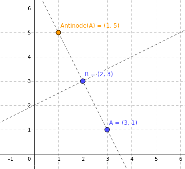

# Day 08: Resonant Collinearity

[Full solution](../src/days/day08.zig).

## Part one

We're given another 2D grid puzzle. This time it's a map of a city with antennas:

```
............
........0...
.....0......
.......0....
....0.......
......A.....
............
............
........A...
.........A..
............
............
```

Antennas are any alphanumeric character in the map. In part one, for each antenna we have to calculate it's **antinode**. The wording in the puzzle page is confusing, but the point (😉) is that the antinode of antenna $A$ against antenna $B$ is the [reflection ](https://en.wikipedia.org/wiki/Point_reflection)of $A$ accross $B$: $Antinode(A) = 2B - A$, where $A$ and $B$ are position vectors. Here's an example plotted in a cartesian plane:



Antinodes only happen to antennas of the same type (represented by the same character in the map). Antinodes can also overlap with other antennas. For part one, we have to find all the unique points where an antinode can be. To do this, we'll iterate over pairs of antennas, find both antinodes and insert them into a set of points. Since sets can only contain unique items, the number of items in the set is the number of unique antinode locations in the map.

First, we'll parse the input:

```zig
fn Day08(length: usize) type {
    return struct {
        antennas: std.AutoHashMap(u8, std.ArrayList([2]u8)) = undefined,
        allocator: std.mem.Allocator,

        const Self = @This();

        fn init(input: []const u8, allocator: std.mem.Allocator) !Self {
            var result = Self{ .allocator = allocator };
            result.antennas = std.AutoHashMap(u8, std.ArrayList([2]u8)).init(allocator);

            var i: usize = 0;
            var lexer = std.mem.tokenizeScalar(u8, input, '\n');
            while (lexer.next()) |line| : (i += 1) {
                for (line, 0..) |c, j| {
                    if (c == '.') continue;
                    const entry = try result.antennas.getOrPutValue(
                        c,
                        std.ArrayList([2]u8).init(allocator),
                    );
                    try entry.value_ptr.append(.{ @intCast(i), @intCast(j) });
                }
            }

            return result;
        }
    };
}
```

We parsed the antennas into a mapping of antenna characters to their locations in the map. We are dynamically allocating memory here, but the benchmark results of the code is already fast enough (even faster than days six and seven that doesn't allocate at all), so I kept the code as is.

Next, we define a `antinode_of` function to calculate the antinode of two points:

```zig
fn antinode_of(a: [2]u8, b: [2]u8) ?[2]u8 {
    const x = @as(i16, b[0] * 2) - a[0];
    const y = @as(i16, b[1] * 2) - a[1];
    if (x < 0 or y < 0 or x >= length or y >= length) return null;
    return .{ @intCast(x), @intCast(y) };
}
```

Since antinodes can be out of bounds, we'll use an optional return type and return `null` if it is out of bounds. This will simplify the solution logic later so that we can do:

```zig
if (antinode_of(a, b)) |antinode| {
    // Do something with valid antinode.
}
```

Instead of:

```zig
var antinode = antinode_of(a, b);
if (antinode[0] >= 0 and antinode[1] >= 0 and antinode[0] < length and antinode[1] < length) {
    // Do something with valid antinode.
}
```

And here's the solution for part one:

```zig
fn part1(self: Self) !u64 {
    var antinodes = std.AutoHashMap([2]u8, void).init(self.allocator);
    defer antinodes.deinit();

    var iterator = self.antennas.iterator();
    while (iterator.next()) |entry| {
        const antennas = entry.value_ptr.*.items;
        for (antennas[0..(antennas.len - 1)], 0..) |antenna_a, i| {
            for (antennas[(i + 1)..antennas.len]) |antenna_b| {
                if (antinode_of(antenna_a, antenna_b)) |antinode| {
                    try antinodes.put(antinode, {});
                }
                if (antinode_of(antenna_b, antenna_a)) |antinode| {
                    try antinodes.put(antinode, {});
                }
            }
        }
    }
    return antinodes.count();
}
```

Zig doesn't have a set type built-in, but we can use `std.AutoHashMap(T, void)` as a set. In fact this is how sets are implemented in some languages, e.g. Python.

## Part two

Part two comes with a more confusing description. This time, for each pair of antennas, we have to keep finding the antinodes recursively until we reach the end of the map. E.g., after finding $Antinode(A, B)$, we have to find $Antinode(B, Antinode(A, B))$, and so on until the antinode is out of bounds. We also have to include the antennas themselves into the final antinode count, because the also count as antinodes.

We can reuse most of the code from part one and just change the part where we find the antinodes to find all antinodes until we reach out of bounds:

```zig
fn part2(self: Self) !u64 {
    var antinodes = std.AutoHashMap([2]u8, void).init(self.allocator);
    defer antinodes.deinit();

    var iterator = self.antennas.iterator();
    while (iterator.next()) |entry| {
        const antennas = entry.value_ptr.*.items;
        for (antennas[0..(antennas.len - 1)], 0..) |antenna_a, i| {
            try antinodes.put(antenna_a, {});

            for (antennas[(i + 1)..antennas.len]) |antenna_b| {
                try antinodes.put(antenna_b, {});

                var current_a = antenna_a;
                var current_b = antenna_b;
                while (antinode_of(current_a, current_b)) |antinode| {
                    try antinodes.put(antinode, {});
                    current_a = current_b;
                    current_b = antinode;
                }
                current_a = antenna_b;
                current_b = antenna_a;
                while (antinode_of(current_a, current_b)) |antinode| {
                    try antinodes.put(antinode, {});
                    current_a = current_b;
                    current_b = antinode;
                }
            }
        }
    }
    return antinodes.count();
}
```

## Benchmarks
